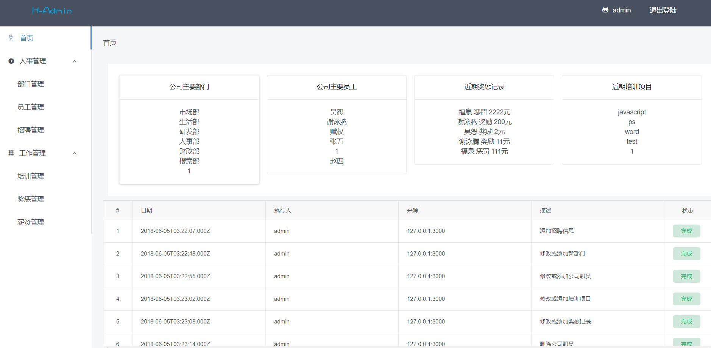
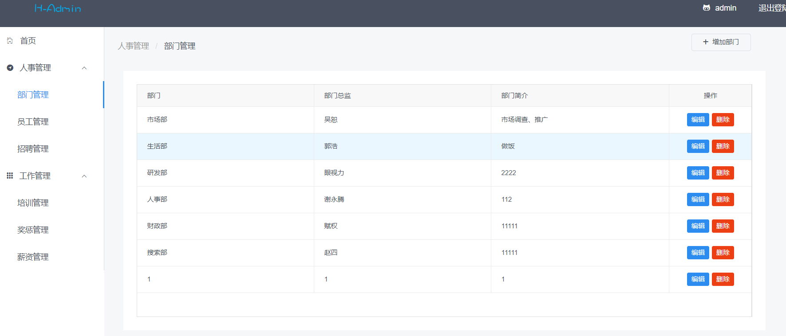

# 前言
基于vue+koa2+mysql的人事管理系统

## 功能
- 部门、员工、招聘、培训、奖惩、薪资等的增删改查
- 登陆、注销
- 操作日志记录

## 操作界面
### 登陆

### 首页

### 操作


#### **依赖安装**
```bash
cd front
npm i
cd server
npm i
```

#### **导入数据库**
> 将keshe.sql导入本地数据库

#### **本地运行**
```bash
cd front
npm run dev
cd server
node app.js
```

#### **技术栈**
vue2 +vue-router + webpack +ES6/7 + iview + koa2 + sequelize

#### **项目环境**
> Node版本8.0及以上 
